# Chapter 18 - 슬라이스

------

## #MUSTHAVE

- 슬라이스 소개
  - 슬라이스는 Go 언어에서 제공하는 동적 배열
  - 또한 슬라이싱 기능을 이용해 배열의 일부를 나타내는 슬라이스를 만들 수 있음
- 장점
  - 길이가 요소 개수에 따라 자동으로 증가해 관리가 편함
  - 슬라이싱 기능을 사용해 배열의 일부를 나타내는 슬라이스를 만들 수 있어 유용함

## 18.1 슬라이스

### 슬라이스 선언

- 일반적인 배열은 처음 배열을 만들 때 정한 길이에서 더 이상 늘어나지 않음 → 슬라이스를 사용

- 슬라이스는 배열과 비슷하지만 [ ] 안에 배열의 개수를 적지 않고 선언

  ```go
  var slice []int
  ```

  - 슬라이스를 초기화하지 않으면 길이가 0인 슬라이스가 만들어짐. 그래서 슬라이스 길이를 초과해서 접근하면 런 타임 에러가 발생

  ```go
  //ch18/ex18.1/ex18.1.go
  package main
  
  import "fmt"
  
  func main() {
  	var slice []int
  
  	if len(slice) == 0 { // ❶ slice 길이가 0인지 확인
  		fmt.Println("slice is empty", slice)
  	}
  
  	slice[1] = 10 // ❷ 에러 발생(패닉)
  	fmt.Println(slice)
  }
  ```

- **{}를 이용해 초기화하기**

  - 첫 번째 초기화 방법은 배열처럼 { } 를 사용해 요솟값을 지정하는 방법

  ```go
  var slice1 = []int{1, 2, 3}
  var slice2 = []int{1, 5:2, 10:3} // [1 0 0 0 0 2 0 0 0 0 3]
  ```

  - 주의

    ```go
    var array = [...]int{1,2,3} // 배열 선언
    var slice = []int{1, 2, 3} // 슬라이스 선언
    ```

- **make()를 이용한 초기화**

  - make() 함수의 **첫 번째 인수**로 만들고자 하는 타입을 적고, **두번째 인수**로 길이를 적어줌

  ```go
  var slice = make([]int, 3)
  ```

### 슬라이스 요소 접근

- 슬라이스 요소 접근 방법은 배열과 동일

  ```go
  var slice = make([]int, 3)
  slice[1] = 5
  ```

### 슬라이스 순회

- 순회 역시 배열과 동일

  ```go
  var slice = []int{1, 2, 3}
  
  for i :=0; i < len(slice); i++ {
  
  	slice[i] +=10
  }
  
  for i, v:=range slice {
  	slice[i] = v * 2
  }
  ```

### 슬라이스 요소 추가 - append()

- 슬라이스는 요소를 추가해 길이를 늘릴 수 있음, 요소 추가에는 append() 내장 함수를 사용

- append()는 첫 번째 인수로 추가하고자 하는 슬라이스를 적고, 그 뒤에 요소를 적어주면 슬라이스 맨 뒤에 요소를 추가해 **만든 새로운 슬라이스를 결과로 반환하게 됨**

  ```go
  //ch18/ex18.2/ex18.2.go
  package main
  
  import "fmt"
  
  func main() {
  
  	var slice = []int{1, 2, 3} // ❶ 요소가 3개인 슬라이스
  
  	slice2 := append(slice, 4) // ❷ 요소 추가
  
  	fmt.Println(slice)
  	fmt.Println(slice2)
  }
  ```

  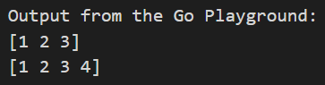

### 여러 값 추가

- append()를 사용해서 값을 하나 이상 추가 할 수 있음

  ```go
  slice = append(slice, 3, 4, 5, 6, 7)
  ```

  ```go
  //ch18/ex18.3/ex18.3.go
  package main
  
  import "fmt"
  
  func main() {
  	var slice []int
  
  	for i := 1; i <= 10; i++ { // ❶ 요소를 하나씩 추가
  		slice = append(slice, i)
  	}
  
  	slice = append(slice, 11, 12, 13, 14, 15) // ❷ 한 번에 여러 요소 추가
  	fmt.Println(slice)
  }
  ```

## 18.2 슬라이스 동작 원리

- 슬라이스 내부 정의

  - 포인터를 가지고 있어, 슬라이스 변수 대입 시 배열에 비해서 사용되는 메모리나 속도에 이점이 있음

  ```go
  type SliceHeader struct {
  		Data uintptr    // 실제 배열을 가리키는 포인터
  		Len  int        // 요소 개수
  		Cap  int        // 실제 배열의 길이
  }
  ```

  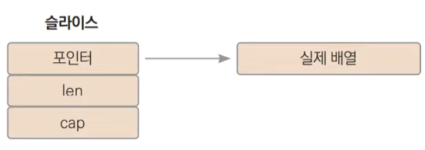

### make() 함수를 이용한 선언

- make() 함수를 사용해 슬라이스를 만들 때, 인수를 2개 혹은 3개를 넣음

  - slice는 len이 3이고, cap이 3인 배열

  ```go
  var slice = make([]int, 3)
  ```

  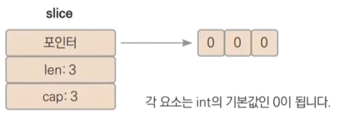

  ```go
  var slice2 = make([]int, 3, 5)
  ```

  - slice2는 len:3 cap:5인 슬라이스가 만들어짐

  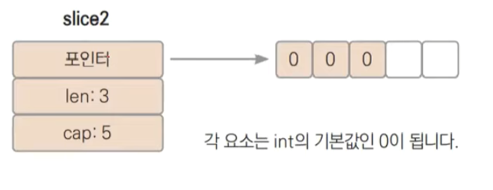

### 슬라이스와 배열의 동작 차이

- 예시

  - **changeArray() 인수로 사용한 array 배열의 3번째 값이 바뀌지 않음**

  ```go
  //ch18/ex18.4/ex18.4.go
  package main
  
  import "fmt"
  
  func changeArray(array2 [5]int) { // ❶ 배열을 받아서 세 번째 값 변경
  	array2[2] = 200
  }
  
  func changeSlice(slice2 []int) { // ❷ 슬라이스를 받아서 세 번째 값 변경
  	slice2[2] = 200
  }
  
  func main() {
  	array := [5]int{1, 2, 3, 4, 5}
  	slice := []int{1, 2, 3, 4, 5}
  
  	changeArray(array)
  	changeSlice(slice)
  
  	fmt.Println("array:", array)
  	fmt.Println("slice:", slice)
  }
  ```

  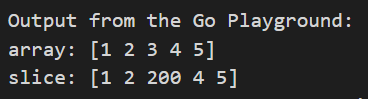

### 동작 차이의 원인

- **Go 언어에서 모든 값의 대입은 복사로 일어남**
- **changeArray() 함수가 호출되는 경우**
- 위 코드에서 array와 array2는 메모리 공간이 다른, 즉 완전히 다른 배열이기 때문에 array2의 세 번째 값을 200으로 변경해도 array 배열은 변경되지 않음

------

- **changeSlice() 함수가 호출되는 경우**
- slice 타입은 []int로 타입의 내부는 포인터, len, cap 세개의 필드를 갖는 구조체
- 포인터는 메모리 주소로 8byte 길이이고, len과 cap은 각각 int 타입으로 8바이트 길이이기 때문에 슬라이스 크기는 24바이트입니다.
- **changeSlice() 함수의 인수로 slice가 입력되어 호출되면 slice 내부의 포인터가 가리키는 배열 크기에 상관없이 항상 총 24바이트 값이 복사됨**
- slice와 slice2 모두 같은 배열 데이터를 가리키기 때문에 slice[2] 값 또한 바뀌게 된 것

### append()를 사용할 때 발생하는 예기치 못한 문제 1

- append() 함수가 호출되면 먼저 슬라이스에 값을 추가할 수 있는 빈 공간이 있는지 확인
- 남은 빈 공간은 실제 배열 길이 cap에서 슬라이스 요소 개수 len을 뺀 값

```go
남은 빈 공간 = cap - len
```

- 남은 빈 공간의 개수가 추가하는 값의 개수보다 크거나 같은 경우 배열 뒷부분에 값을 추가한 뒤 len 값을 증가 시킴
- 예시

```go
//ch18/ex18.5/ex18.5.go
package main

import "fmt"

func main() {
	slice1 := make([]int, 3, 5) // ❶ len:3 cap:5 슬라이스를 만듭니다

	slice2 := append(slice1, 4, 5)
	// cap() 함수를 이용해 슬라이스 capacity 값을 알 수 있습니다.
	fmt.Println("slice1:", slice1, len(slice1), cap(slice1))
	fmt.Println("slice2:", slice2, len(slice2), cap(slice2))

	slice1[1] = 100 // ❷ slice2까지 바뀝니다.

	fmt.Println("After change second element")
	fmt.Println("slice1:", slice1, len(slice1), cap(slice1))
	fmt.Println("slice2:", slice2, len(slice2), cap(slice2))

	slice1 = append(slice1, 500) // ❸ 역시 slice2까지 바뀝니다.

	fmt.Println("After append 500")
	fmt.Println("slice1:", slice1, len(slice1), cap(slice1))
	fmt.Println("slice2:", slice2, len(slice2), cap(slice2))
}
```

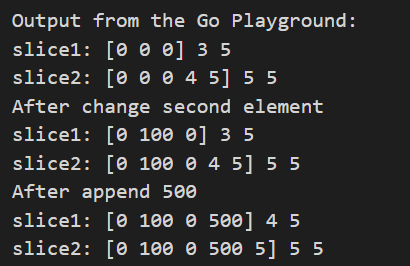

### append()를 사용할 때 발생하는 예기치 못한 문제 2

- 만약 빈공간이 없을 때 값을 추가한 경우
- 만약 빈공간이 충분하지 않으면 새로운 더 큰 배열을 마련
  - 일반적으로 기존 배열의 2배 크기로 마련
  - 그런 뒤 기존 배열의 요소를 모두 새로운 배열에 복사
  - 그리고 새로운 배열의 맨 뒤에 새 값을 추가
  - 포인터는 새로운 배열을 가리키는 슬라이스 구조체를 반환

```go
//ch18/ex18.6/ex18.6.go
package main

import "fmt"

func main() {
	slice1 := []int{1, 2, 3} // ❶ len:3 cap:3 슬라이스 생성

	slice2 := append(slice1, 4, 5) // ❷ append() 함수로 요소 추가

	fmt.Println("slice1:", slice1, len(slice1), cap(slice1))
	fmt.Println("slice2:", slice2, len(slice2), cap(slice2))

	slice1[1] = 100 // ❸ slice1 요솟값 변경

	fmt.Println("After change second element")
	fmt.Println("slice:", slice1, len(slice1), cap(slice1))
	fmt.Println("slice2:", slice2, len(slice2), cap(slice2))

	slice1 = append(slice1, 500) // ➍ slice1 요솟값 변경

	fmt.Println("After append 500")
	fmt.Println("slice1:", slice1, len(slice1), cap(slice1))
	fmt.Println("slice2:", slice2, len(slice2), cap(slice2))
}
```

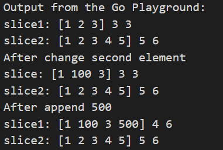

## 18.3 슬라이싱

- 슬라이싱 기능을 사용하면 그 결과로 슬라이스를 반환받게 됨

```go
array[startIdx:endindex]
//ch18/ex18.7/ex18.7.go
package main

import "fmt"

func main() {
	array := [5]int{1, 2, 3, 4, 5}

	slice := array[1:2] // ❶ 슬라이싱

	fmt.Println("array:", array)
	fmt.Println("slice:", slice, len(slice), cap(slice))

	array[1] = 100 // ❷ array의 두 번째 값 변경

	fmt.Println("After change second element")
	fmt.Println("array:", array)
	fmt.Println("slice:", slice, len(slice), cap(slice))

	slice = append(slice, 500) // ❸ slice에 값 추가

	fmt.Println("After append 500")
	fmt.Println("array:", array)
	fmt.Println("slice:", slice, len(slice), cap(slice))
}
```

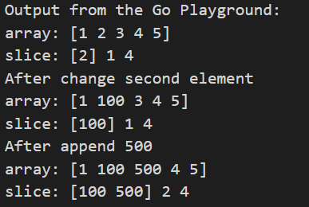

### 슬라이싱으로 배열 일부를 가리키는 슬라이스 만들기

```go
array := [5]int{1, 2, 3, 4, 5}
slice := array[1:2]
```

- slice의 포인터는 배열 시작인덱스 1의 두 번째 요소 메모리 주소를 가리킴
- slice는 2값을 갖는 요소 하나만 갖는 슬라이스가 됨
- 저장 공간 크기를 나타내는 cap은 배열의 총길이에서 시작인덱스를  뺀만큼을 가지게 됨
  - array 길이가 5이고 시작인덱스가 1이기 때문에 cap은 4가 됨
- **slice가 array의 두 번째를 가리키므로 array 두 번째 값이 바뀌면 slice 값도바뀜**

```go
array[1] = 100
```

- **slice에 요소를 추가하게 되면 slice의 len은 1이고, cap은 4이기 때문에 빈공간이 남았다고 간주해서 array[2] 요솟값이 변경 됨**

```go
slice = append(slice, 500)
```

### 슬라이스를 슬라이싱하기

- 슬라이싱 기능은 배열뿐 아니라 슬라이스 일부를 집어낼 때도 사용할 수 있음

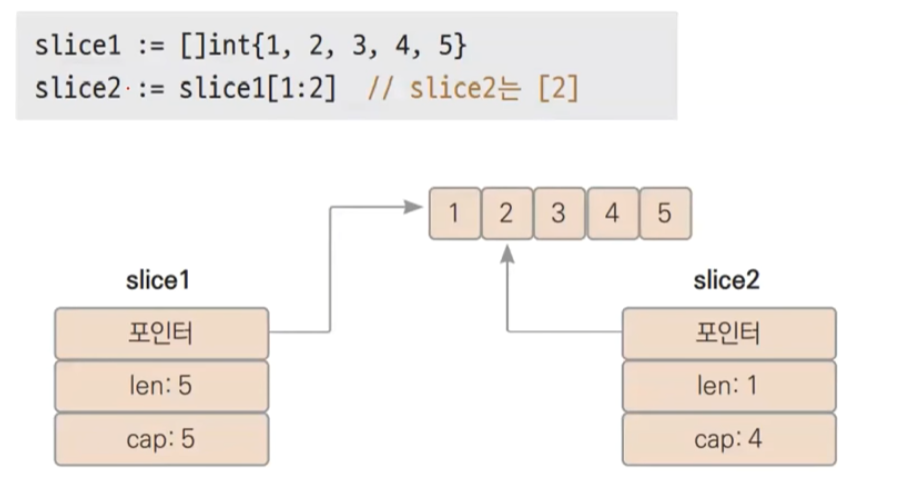

- **처음부터 슬라이싱**

```go
slice1 := []int{1,2,3,4,5}
slice2 := slice1[0:3]  // slice2는 [1,2,3]
slice2 := slice1[:3] // 위와 동일함
```

- **끝까지 슬라이싱**

```go
slice1 := []int{1, 2, 3, 4, 5}
slice2 := slice1[2:len(slice1)] // slice2는 [3, 4, 5]
slice2 := slice1[2:] // 위와 동일함
```

- **전체 슬라이싱**

```go
array := [5]int{1, 2, 3, 4, 5}
slice := array[:]
```

- 인덱스 3개로 슬라이싱해 cap 크기 조절하기
  - 인덱스 2개만 사용할 때 cap은 배열의 전체 길이에서 시작인덱스를 뺀 값이 됨
  - 슬라이싱할 때 인덱스를 3개 사용해서 cap까지 조절할 수 있음

```go
slice [ 시작인덱스 : 끝인덱스 : 최대인덱스 ]
slice1 := []int{1, 2, 3, 4, 5}
slice2 :=[1:3:4]
```

- slice2는 [2, 3]이 되고, cap은 최대 인덱스가 4이므로 4에서 시작인덱스 값인 1을 뺀 값 3이 됨
- **즉, 슬라이싱할 때 세번째 인덱스를 생략하면 배열의 전체 길이를 다 사용하게 되고 세번째 인덱스를 적어주면 그 인덱스까지만 배열을 사용하게 됨**

## 18.4 유용한 슬라이싱 기능 활용

- 슬라이싱과 append() 기능을 활용해 슬라이스 복제, 요소 추가, 요소 삭제하는 방법

### 슬라이스 복제

- 앞선 예제에서의 문제 상황을 피하기 위해 항상 다른 배열을 가리키도록 만드는 방법
  - slice1이 가리키는 배열과 똑같은 배열을 복제한 뒤 slice2가 가리키도록 설정

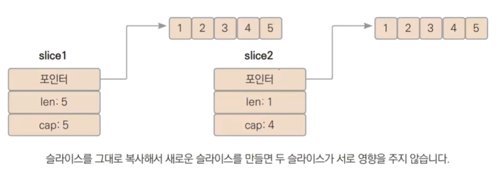

```go
//ch18/ex18.8/ex18.8.go
package main

import "fmt"

func main() {
	slice1 := []int{1, 2, 3, 4, 5}

	slice2 := make([]int, len(slice1)) // ❶ slice1과 같은 길이의 슬라이스 생성

	for i, v := range slice1 { // ❷ slice1의 모든 요소값 복사
		slice2[i] = v
	}

	slice1[1] = 100 // ❸ slice1 요솟값 변경
	fmt.Println(slice1)
	fmt.Println(slice2)
}
```

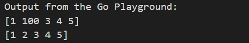

- **append() 함수로 코드 개선하기**

  - 위 코드는 같은 길이의 슬라이스를 만들고 순회를 사용해서 각 요솟값을 복사하기 때문에 복잡
  - 다음과 같이 줄일 수 있음
  - append() 함수를 사용해 slice1의 모든 값을 복제한 새로운 슬라이스를 만들어 slice2에 대입
  - **배열이나 슬라이스 뒤에 …를 하면 모든 요솟값을 넣어준 것과 같게 됨**

  ```go
  slice:=append([]int{}, slice1...)
  ```

  - 즉 위 구문은 아래와 같음

  ```go
  slice2 := append([]int{}, slice1[0], slice1[1], slice1[2], slice1[3], slice1[4])
  ```

- **copy() 함수로 코드 개선하기**

  - copy() 함수 정의

  ```go
  func copy(dst, src []Type) int
  ```

  - 첫 번째 인수로 복사한 결과를 저장하는 슬라이스 변수
  - 두 번째 인수로 복사 대상이 되는 슬라이스 변수
  - 반환 값은 실제로 복사된 요소 개수
  - 실제 복사되는 요소 개수는 목적지의 슬라이스 길이와 대상의 슬라이스 길이 중 작은 개수만큼 복사됨
    - cap 개수는 영향을 주지 않음

  ```go
  //ch18/ex18.9/ex18.9.go
  package main
  
  import "fmt"
  
  func main() {
  	slice1 := []int{1, 2, 3, 4, 5}
  	slice2 := make([]int, 3, 10) // ❶ len:3, cap:10 슬라이스
  	slice3 := make([]int, 10)    // ❷ len:10, cap:10 슬라이스
  
  	cnt1 := copy(slice2, slice1) // ❸ slice1을 slice2에 복사합니다.
  	cnt2 := copy(slice3, slice1) // ❹ slice1을 slice3에 복사합니다.
  
  	fmt.Println(cnt1, slice2)
  	fmt.Println(cnt2, slice3)
  }
  ```

  

  - 이를 이용해서 slice를 복사하는 ex18.8 예제를 다음과 같이 바꿀 수 있음

  ```go
  slice2 := make([]int, len(slice1))
  copy(slice2, slice1)
  ```

### 요소 삭제

1. 슬라이스 중간 요소를 삭제

2. 중간 요소 이후의 갚을 앞당겨서 삭제된 요소를 채움

3. 맨 마지막 값을 삭제

   ```go
   //ch18/ex18.10/ex18.10.go
   package main
   
   import "fmt"
   
   func main() {
   	slice := []int{1, 2, 3, 4, 5, 6}
   	idx := 2 // 삭제할 인덱스
   
   	for i := idx + 1; i < len(slice); i++ { // ❶ 요소 앞당기기
   		slice[i-1] = slice[i]
   	}
   
   	slice = slice[:len(slice)-1] // ❷ 슬라이스로 마지막 값을 잘라줍니다.
   
   	fmt.Println(slice)
   }
   ```

- **append() 함수로 코드 개선하기**

  ```go
  slice=append(slice[:idx],slice[idx+1:]...)
  ```

### 요소 추가

1. 슬라이스 맨 뒤에 요소를 하나 추가

2. 맨 뒤값부터 삽입하려는 위치까지 한 칸씩 뒤로 밀어줌

3. 삽입하는 위치의 값을 바꿔줌

   ```go
   //ch18/ex18.11/ex18.11.go
   package main
   
   import "fmt"
   
   func main() {
   	slice := []int{1, 2, 3, 4, 5, 6}
   
   	// ❶ 맨 뒤에 요소 추가
   	slice = append(slice, 0)
   
   	idx := 2 // 추가하려는 위치
   
   	// ❷ 맨 뒤부터 추가하려는 위치까지 값을 하나씩 옮겨줍니다.
   	for i := len(slice) - 2; i >= idx; i-- {
   		slice[i+1] = slice[i]
   	}
   
   	// ❸ 값 변경
   	slice[idx] = 100
   
   	fmt.Println(slice)
   }
   ```

   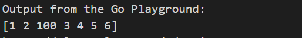

- **append() 함수로 코드 개선하기**

  ```go
  slice = append(slice[:idx], append([]{100}, slicee[idx:]...)...)
  ```

- **불필요한 메모리 사용이 없도록 코드 개선하기**

  - 앞에서 다른 구문에서 생성한 [100, 3, 4, 5, 6] 슬라이스는 임시 슬라이스입니다.
  - 다음 구문을 사용하면 불필요한 메모리를 사용하지 않을 수 있음

  ```go
  slice = append(slice, 0)  // 맨 뒤에 요소 추가
  copy(slice[idx+1:], slice[idx:]) // 값 복사
  slicde[idx] = 100 // 값 변경
  ```

## 18.5 슬라이스 정렬

- Go 언어에서 기본 제공하는 sort 패키지 사용

### int 슬라이스 정렬

- sort 패키지의 Ints() 함수 대신 Float64s() 함수를 이용하면 float64 슬라이스를 정렬할 수 있음

  ```go
  //ch18/ex18.12/ex18.12.go
  package main
  
  import (
  	"fmt"
  	"sort"
  )
  
  func main() {
  	s := []int{5, 2, 6, 3, 1, 4} // ❶ 정렬되지 않은 슬라이스
  	sort.Ints(s)                 // ❷ 정렬
  	fmt.Println(s)
  }
  ```

### 구조체 슬라이스 정렬

- 앞서 Sort() 함수를  이용하기 위해서는 `Len(), Less(), Swap()` 세 메서드가 필요

  ```go
  //ch18/ex18.13/ex18.13.go
  package main
  
  import (
  	"fmt"
  	"sort"
  )
  
  type Student struct {
  	Name string
  	Age  int
  }
  
  // ❶ []Student의 별칭 타입 Students
  type Students []Student
  
  func (s Students) Len() int           { return len(s) }
  func (s Students) Less(i, j int) bool { return s[i].Age < s[j].Age } 
  // ❷ 나이 비교
  func (s Students) Swap(i, j int)      { s[i], s[j] = s[j], s[i] }
  
  func main() {
  	s := []Student{
  		{"화랑", 31}, {"백두산", 52}, {"류", 42},
  		{"켄", 38}, {"송하나", 18}}
  
  	sort.Sort(Students(s)) // ❸ 정렬
  	fmt.Println(s)
  }
  ```

  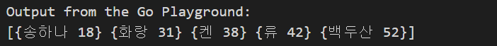

  ❸ []Student를 Students 타입으로 타입 변환한 뒤 sort.Sort() 함수를 호출

  Students는 이미 sort.Interface 메서드들을 포함하고 있기 때문에 sort.Sort() 인수로 사용할 수 있습니다.

  1. Students(s)는 []Student 타입인 s를 정렬 인터페이스를 포함한 타입인 Students 타입으로 변환하는 구문
  2. []Student 타입은 정렬에 필요한 Len(), Less(), Swap() 메서드를 가지고 있지 않기 때문에 sort.Sort() 함수의 인수로 사용될 수 없음
  3. 그래서 []Student의 별칭 타입을 만들어서 정렬 인터페이스를 포함하도록 함